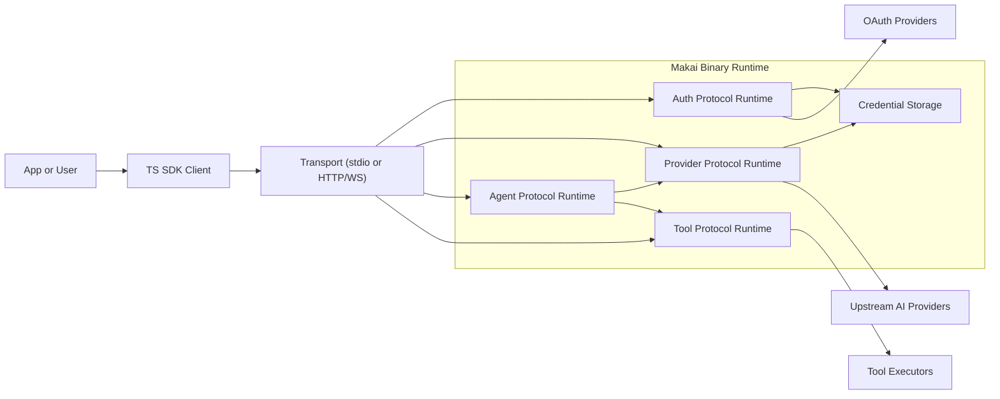
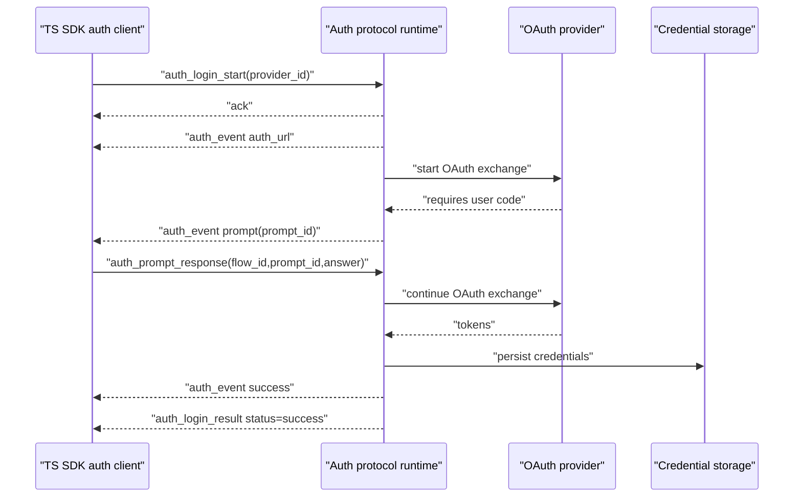
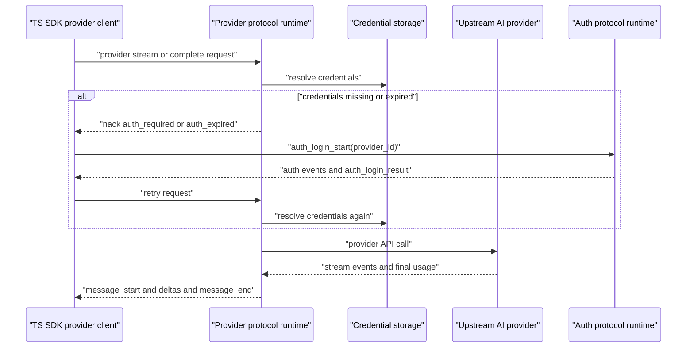
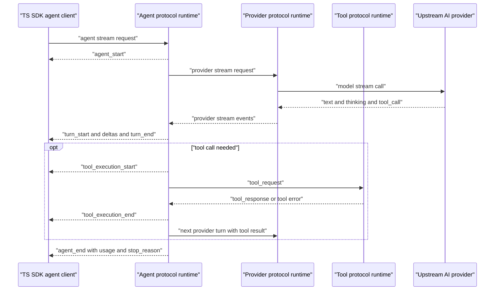
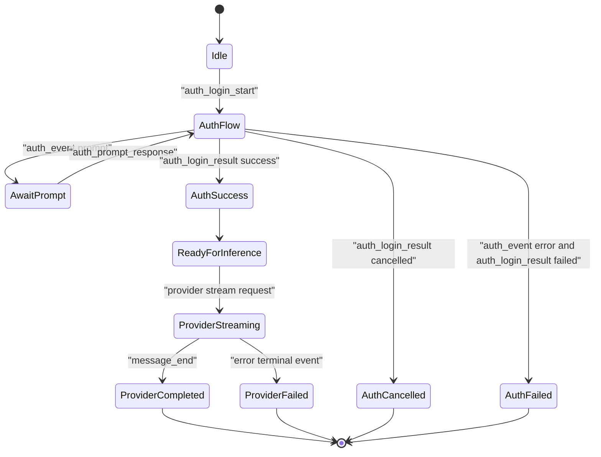
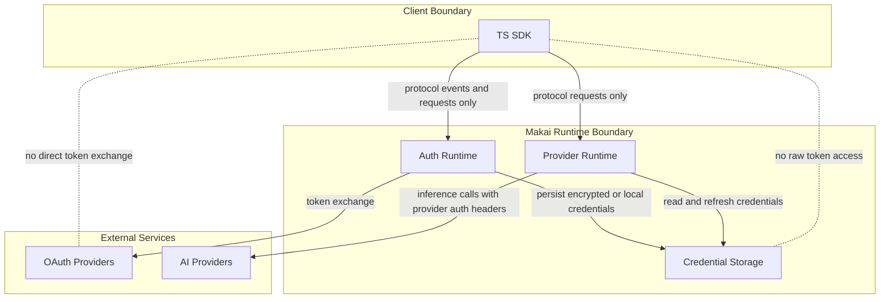

# Makai Design (Single Source of Truth)

Status: authoritative
Scope: architecture, protocol boundaries, ownership model, sequencing, transport posture, testing posture

## 1) Purpose

Makai is a Zig-first streaming AI runtime with:
- distributed auth protocol,
- multi-provider streaming abstraction,
- distributed provider protocol,
- distributed agent protocol,
- distributed tool protocol,
- agent loop + tool execution bridge,
- pluggable transports.

This document is the canonical design reference for the repository.

---

## 2) Core Architecture

Makai is organized into four runtime layers:

1. **Streaming Core**
   - provider-agnostic event types and stream plumbing
   - lock-free `EventStream`
   - core data model (`ai_types`) and utility modules

2. **Provider Layer**
   - implementations for Anthropic/OpenAI/Google/Azure/Ollama/etc.
   - provider credential resolution/refresh and provider-specific request/response translation

3. **Protocol Layer**
   - **auth protocol** (`protocol/auth/*`)
   - **provider protocol** (`protocol/provider/*`)
   - **agent protocol** (`protocol/agent/*`)
   - **tool protocol** (`protocol/tool/*`)
   - envelope serialization, sequence validation, client/server handlers

4. **Agent Layer**
   - agent loop
   - tool execution orchestration
   - direct provider mode or provider-protocol mode via bridge/runtime

Design boundary:
- Agent layer is auth-agnostic.
- Auth protocol/runtime owns interactive OAuth flows + credential persistence.
- Provider layer owns request-time credential consumption/refresh for model calls.

---

## 3) Runtime Placement Clarification

`runtime.zig` modules are **pump/orchestration runtimes**, not protocol definitions.

- `protocol/provider/runtime.zig`
  - pumps client->server messages
  - forwards provider stream events/results/errors server->client
  - used in production integration paths (not test-only)

- `protocol/auth/runtime.zig`
  - pumps auth protocol client/server messages
  - routes interactive auth flow events (`auth_url`, `prompt`, `progress`, terminal result)
  - used for SDK auth APIs and CLI wrapper mode

- `protocol/agent/runtime.zig`
  - pumps agent protocol client/server messages and outbox
  - routes outbound agent events/results to clients

These runtimes are typically hosted on the **server side** of each protocol boundary. In-process setups may host both sides in one process, but ownership is still logically client/server.

---

## 4) Sequencing Model (Normative)

### 4.1 Scope
Sequence is **per session/stream**, never global across all sessions.

- Provider protocol: sequence scope = `stream_id`
- Auth protocol: sequence scope = `flow_id`
- Agent protocol: sequence scope = `session_id`

### 4.2 Rules
For each session/stream independently:
- first inbound request sequence = `1`
- monotonic increment by exactly `+1`
- duplicates and gaps are invalid
- concurrent sessions maintain independent counters

### 4.3 Implication
Client implementations must maintain a sequence counter map keyed by session/stream ID. A single global sequence counter is non-conformant.

---

## 5) Multiplexing Model (Normative)

Auth/provider/agent protocols are designed for multi-session multiplexing:
- multiple active auth flows concurrently
- multiple active provider streams concurrently
- multiple active agent sessions concurrently
- envelopes interleaved by transport
- ordering guaranteed only within a session/stream, not globally

Implementation objective:
- auth, provider, and agent clients/servers must support true concurrent multiplexing.

### 5.1 Provider protocol client lifecycle API (normative usage)

For multiplexed provider streams, callers should use per-stream APIs explicitly:

1. `startStream(...)` -> keep returned `stream_id`
2. `getEventStreamFor(stream_id)` -> consume events for only that stream
3. `waitResultFor(stream_id, timeout_ms)` / `getLastErrorFor(stream_id)` -> terminal query
4. `closeStream(stream_id)` when terminating locally
5. `removeStreamState(stream_id)` after terminal consumption to release per-stream state

This lifecycle keeps stream state isolated and prevents long-lived client state growth.

---

## 6) Memory Ownership Model (Critical)

`EventStream` does not universally own borrowed provider strings.

Canonical ownership rules:
1. Provider-produced stream events may contain borrowed slices tied to provider buffers.
2. Protocol client paths that persist events must deep-copy (`clone*`) before queue ownership transfer.
3. Any queue that owns events must explicitly opt into owned-event cleanup semantics.
4. Never add blanket event-string deinit in generic `EventStream.deinit()`; this causes double-free in borrowed-string paths.

This ownership model is non-optional and must be preserved in future refactors.

---

## 7) Tool Protocol Design

Tooling is modeled as a first-class distributed protocol concern.

### 7.1 Goals
- allow agent-loop tool execution to run local or remote
- support security isolation by running tools on different machines/processes
- keep request/response and event streaming consistent with existing protocol style

### 7.2 Required message capabilities
At minimum:
- `tool_request` (agent -> tool executor)
- `tool_response` (tool executor -> agent)
- optional streaming tool events for long-running tools:
  - `tool_execution_start`
  - `tool_execution_update` (stdout/stderr/progress)
  - `tool_execution_end`

### 7.3 Correlation + sequencing
- all tool messages are correlated via tool call id + session id
- sequencing remains per session
- tool events can be interleaved across tool calls, ordered per call/session

### 7.4 Failure model
- explicit tool error payloads (typed code + message)
- timeout/cancel support
- deterministic terminal event per tool execution

---

## 8) Transport Posture

### 8.1 Current
- in-process transport: core path for local/protocol integration
- stdio transport: supported
- websocket transport: functional but requires hardening + expanded test depth
- auth/provider/agent/tool protocols must share the same transport posture and semantics

### 8.2 Direction
- increase websocket test rigor (framing, backpressure, reconnects, malformed frames, ordering)
- evaluate Bun-inspired lower-level networking approach (C/C++ interop) where it materially improves websocket robustness/perf
- keep transport interfaces stable (`Sender/Receiver`, async sender/receiver abstraction)

### 8.3 Low-level socket/C-C++ interop options (Batch G note)

1. **Option A (default): pure Zig + `libxev` hardening**
   - continue improving current websocket transport and tests
   - lowest integration risk and simplest ownership model

2. **Option B: hybrid C socket engine + Zig protocol/runtime**
   - wrap battle-tested C/C++ socket stack (for example uSockets/libuv-family)
   - keep Makai protocol/agent/tool layers in Zig
   - highest potential perf upside, highest build/debug complexity

3. **Option C: focused interop slices only**
   - keep websocket state machine in Zig, offload narrow hot paths
   - examples: parser/TLS or socket poll primitives only
   - medium complexity, medium upside

Evaluation rule: stay on Option A unless the objective gate in 8.5 passes.

### 8.4 Objective benchmark + reliability criteria

A candidate interop path must be measured against current websocket transport on
the same host class and workload profile.

Required reliability thresholds (hard gate):
- crash_count = 0
- leak_count = 0
- ordering_violations = 0
- backpressure_failures = 0
- reconnect_success_rate >= 99.9%

Required performance thresholds (at least one):
- p99_latency_ms <= baseline * 0.80, **or**
- throughput_msgs_per_sec >= baseline * 1.25

### 8.5 Minimal POC decision gate (go/no-go)

- Collect baseline + candidate metrics JSON with the fields above.
- Run `./scripts/websocket-poc-gate.sh <metrics.json>`.
- **GO** only when all reliability thresholds pass and at least one performance
  threshold passes; otherwise **NO-GO**.
- Default decision without complete metrics is **NO-GO**.

---

## 9) Test Strategy (Normative)

### 9.1 Required categories
1. Unit tests per module
2. Protocol negative tests (sequence/unknown session/malformed payload) across auth/provider/agent/tool
3. Runtime multi-session tests (auth + agent + provider)
4. Chain integration tests:
   - Auth: Client -> protocol/auth -> OAuth provider integration -> credential storage
   - Inference: Client -> protocol/agent -> agent_loop -> protocol/provider -> provider
5. Transport stress/hardening tests (especially websocket)

### 9.2 CI expectations
- all grouped unit jobs green
- protocol E2E mock lane green
- auth protocol flow lane green (including prompt/cancel/terminal semantics)
- provider fullstack lanes monitored for external flake patterns
- CLI auth wrapper compatibility lane green (`makai auth providers/login` over auth protocol runtime)

---

## 10) Canonical Distributed Topology

Target end-to-end topology:

1. User/client connects to **auth/agent protocol servers** (same process or distributed)
2. OAuth flows execute through **auth protocol server** when login is required
3. Agent loop executes on agent node
4. Agent connects to **provider protocol server** for model streaming
5. Agent executes tools via local or remote **tool protocol executors**
6. Events/results stream back through protocol boundaries to client

This is the canonical architecture for distributed operation.

---

## 11) Diagrams

### 11.1 System Context

### 11.2 Auth Login Sequence

### 11.3 Provider Direct Sequence

### 11.4 Agent End-to-End Sequence

### 11.5 Auth and Stream Lifecycle States

### 11.6 Credential Ownership Boundaries

---

## 12) Non-Goals / Deferred Areas

- provider-specific auth logic in agent layer (explicitly forbidden)
- CLI-subprocess-as-primary auth path in SDKs (explicitly forbidden)
- weakening ownership guarantees for convenience
- global-sequence semantics across sessions

Deferred roadmap items should be tracked in implementation tasks, not in competing design docs.
